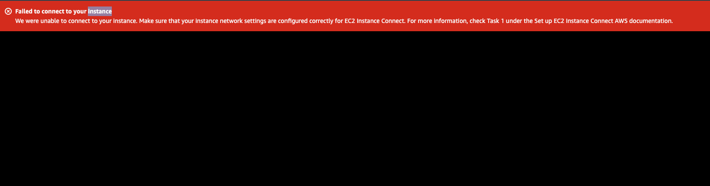
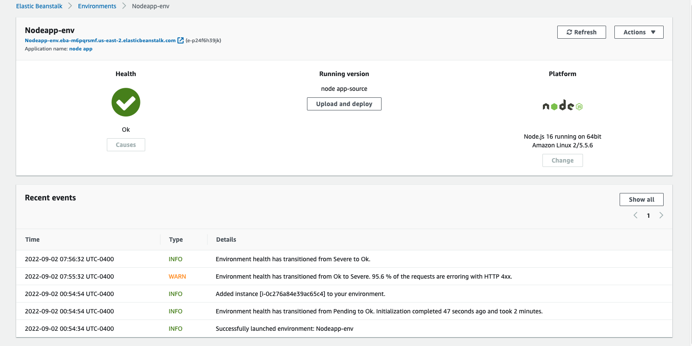

# Lab: AWS: Cloud Servers

- Deploy a Node.js server to AWS EC2

## Feature Tasks

- Deploy a simple Node.js server to EC2, using Elastic Beanstalk

## Task 1:

- Create a new environment, using Elastic Beanstalk from the AWS Control Panel (GUI)
- Manually deploy your application to this environment by uploading a .zip file

## Task 2:

- Using the same server, create a new environment using Elastic Beanstalk from your terminal
- Manually deploy your application to this environment by using eb deploy

## Approach and Efficiency

- I tried to deploy the Event-driven Application. 

### EC2 Deployment

[GUI deploy](http://nodeapp-env.eba-m6pqrsmf.us-east-2.elasticbeanstalk.com/)

I am experiencing some issues on CLI deployment.I couldn't deploy it.  

### Collaborators

- David
